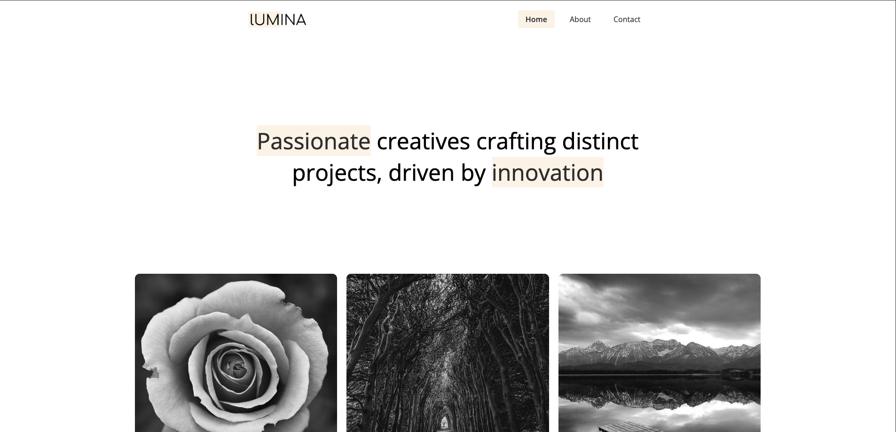
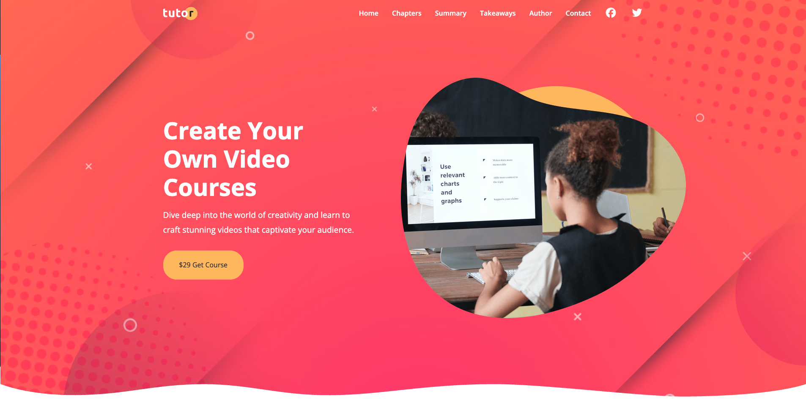
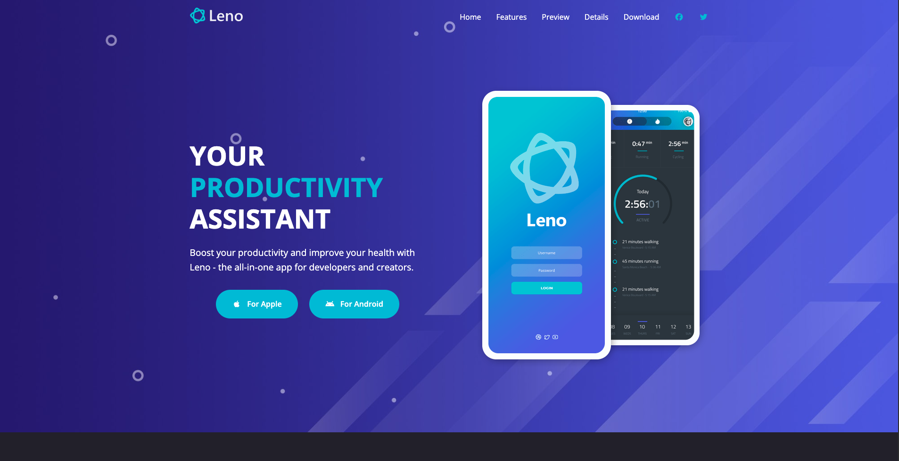

# Frontend Projects Collection

A collection of frontend web projects built with HTML, CSS, and JavaScript. The repository contains four larger website projects and three smaller practice projects.

---

## Project Structure

```text
.
├── bono-landing-form/
├── lumina-creative/
├── tutor-website/
├── leno-website/
├── shoe-cards-project/
├── pricing-grid-project/
├── presentation-website/
└── README.md
```

---

# Big Projects

## 1. Bono Landing Form

**Folder root:** `./bono-landing-form/`

**Live Demo:** https://dashing-mooncake-082de3.netlify.app/

### Overview

Bono is a clean landing and sign-up page for a fictional web application focused on content management. The project emphasizes a simple hero section, clear messaging, contact information, and a compact contact form.

### Features

- Responsive landing page layout
- Hero section with background imagery
- Contact/sign-up form
- Contact information and social elements
- Custom Bono branding and favicon
- Font Awesome icons
- Google Fonts integration

### Technologies

- HTML5
- CSS3
- Font Awesome
- Google Fonts

### Folder Structure

```text
bono-landing-form/
├── index.html
├── css/
│   └── styles.css
└── images/
    ├── background.jpg
    ├── favicon.png
    └── logo.svg
```

### Screenshot


---

## 2. Lumina Creative

**Folder root:** `./lumina-creative/`

**Live Demo:** https://6a992155be397f8d8a1ab9e3--sage-entremet-b66951.netlify.app/

### Overview

Lumina Creative is a multi-page creative agency website designed to showcase a portfolio, introduce the agency and team, describe services, and provide a contact page. The design focuses on visual presentation and portfolio browsing.

### Pages

- Home — `index.html`
- About — `about.html`
- Contact — `contact.html`

### Features

- Multi-page website
- Creative agency landing page
- Portfolio/gallery section
- Lightbox-based image viewing
- Services section
- Team section
- Contact page
- Responsive styling
- Font Awesome icons

### Technologies

- HTML5
- CSS3
- jQuery
- Lightbox2
- Font Awesome
- Google Fonts

### Folder Structure

```text
lumina-creative/
├── index.html
├── about.html
├── contact.html
├── css/
│   └── styles.css
└── images/
    ├── logo.png
    ├── favicon.ico
    ├── portfolio*.jpg
    ├── image*.jpg
    └── team*.jpg
```

### Screenshot



---

## 3. Tutor Website

**Folder root:** `./tutor-website/`

**Live Demo:** https://bss-internship.vercel.app/

### Overview

Tutor is a course-focused website for presenting and promoting an online video course. It provides a structured learning experience with course chapters, learning objectives, takeaways, testimonials, and contact information.

### Pages

- Home — `index.html`
- Contact — `contact.html`

### Features

- Course landing page
- Course introduction and pricing
- Learning objectives
- Course chapters
- Course summary
- Testimonials
- Partner/brand logos
- Author section
- Contact and office-location section
- Responsive navigation
- Interactive JavaScript elements

### Technologies

- HTML5
- CSS3
- JavaScript
- Font Awesome
- Google Fonts

### Folder Structure

```text
tutor-website/
├── index.html
├── contact.html
├── css/
│   └── styles.css
├── js/
│   └── script.js
└── images/
    ├── logo.svg
    ├── favicon.png
    ├── author.png
    ├── header-background.jpg
    ├── header-course.png
    ├── details.png
    ├── stats.png
    ├── description-*.jpg
    ├── testimonial-*.jpg
    ├── partner-logo-*.png
    └── chapters-icon-*.svg
```

### Screenshot



---

## 4. Leno Website

**Folder root:** `./leno-website/`

**Live Demo:** https://zingy-dodol-213c9d.netlify.app/

### Overview

Leno is a modern product website for a fictional health and productivity application. It presents the application's value proposition, features, testimonials, screenshots, pricing options, and download information.

### Pages

- Home — `index.html`
- Details — `details.html`

### Features

- Product-focused landing page
- Health and productivity messaging
- Feature highlights
- Customer testimonials
- Product screenshots
- Pricing section
- Download section
- Detailed product page
- Responsive navigation
- Interactive JavaScript elements
- Back-to-top functionality

### Technologies

- HTML5
- CSS3
- JavaScript
- Font Awesome
- Google Fonts

### Folder Structure

```text
leno-website/
├── index.html
├── details.html
├── css/
│   └── styles.css
├── js/
│   └── script.js
└── images/
    ├── logo.svg
    ├── favicon.png
    ├── header-background.jpg
    ├── header-smartphones.png
    ├── features-smartphone-*.png
    ├── screenshot-*.png
    ├── testimonial-*.jpg
    ├── details-*.png
    ├── download.png
    └── ...
```

### Screenshot



---

# Mini Projects

The following projects are smaller HTML/CSS exercises focused on practicing layout, typography, responsive design, cards, grids, and reusable UI patterns.

## 1. Shoe Cards Project

**Folder root:** `./shoe-cards-project/`

A simple product-card layout presenting three shoe categories: **Sporty, Casual, and Formal**. The project focuses on card composition, typography, imagery, spacing, and responsive layout.

**Technologies:** HTML5, CSS3

```text
shoe-cards-project/
├── index.html
├── styles.css
└── images/
    ├── sporty.png
    ├── casual.png
    └── formal.png
```

---

## 2. Pricing Grid Project

**Folder root:** `./pricing-grid-project/`

A pricing-table UI containing three subscription tiers: **Free, Pro, and Enterprise**. The project focuses on CSS Grid/Flexbox-style layout, visual hierarchy, pricing cards, and feature presentation.

**Technologies:** HTML5, CSS3, Font Awesome, Google Fonts

```text
pricing-grid-project/
├── index.html
└── styles.css
```

---

## 3. Presentation Website

**Folder root:** `./presentation-website/`

A lightweight presentation-style webpage containing multiple presentation sections. It is primarily a practice project for structuring a visually clean page and applying typography, spacing, and responsive CSS.

**Technologies:** HTML5, CSS3, Font Awesome, Google Fonts

```text
presentation-website/
├── index.html
└── styles.css
```

---

# Technology Summary

| Project | HTML | CSS | JavaScript | External Libraries |
|---|:---:|:---:|:---:|---|
| Bono Landing Form | ✓ | ✓ | — | Font Awesome, Google Fonts |
| Lumina Creative | ✓ | ✓ | — | jQuery, Lightbox2, Font Awesome, Google Fonts |
| Tutor Website | ✓ | ✓ | ✓ | Font Awesome, Google Fonts |
| Leno Website | ✓ | ✓ | ✓ | Font Awesome, Google Fonts |
| Shoe Cards | ✓ | ✓ | — | Google Fonts |
| Pricing Grid | ✓ | ✓ | — | Font Awesome, Google Fonts |
| Presentation Website | ✓ | ✓ | — | Font Awesome, Google Fonts |

---

# Live Projects

| Project | Live Demo |
|---|---|
| Bono Landing Form | https://dashing-mooncake-082de3.netlify.app/ |
| Lumina Creative | https://6a992155be397f8d8a1ab9e3--sage-entremet-b66951.netlify.app/ |
| Tutor Website | https://bss-internship.vercel.app/ |
| Leno Website | https://zingy-dodol-213c9d.netlify.app/ |
